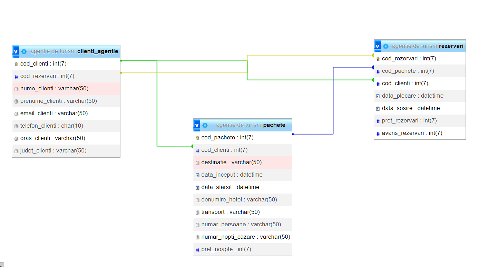

Baza de date Agentie de turism
Create database 'agentie de turism'
CREATE TABLE `clienti_agentie` (
  `cod_clienti` int(7) NOT NULL,
  `cod_rezervari` int(7) NOT NULL,
  `nume_clienti` varchar(50) NOT NULL,
  `prenume_clienti` varchar(50) NOT NULL,
  `email_clienti` varchar(50) NOT NULL,
  `telefon_clienti` char(10) NOT NULL,
  `oras_clienti` varchar(50) NOT NULL,
  `judet_clienti` varchar(50) NOT NULL
INSERT INTO `clienti_agentie` (`cod_clienti`, `cod_rezervari`, `nume_clienti`, `prenume_clienti`, `email_clienti`, `telefon_clienti`, `oras_clienti`, `judet_clienti`) VALUES
(516, 1006, 'Vladu', 'Anca', 'ancavladu79@yahoo.com', '0769841265', 'Sibiu', 'Sibiu'),
(1001, 201, 'Popescu', 'Simona', 'popescusimona99@yahoo.com', '0721356987', 'Craiova', 'Dolj'),
(1002, 512, 'Popa', 'Andreea', 'popaluminita76@yahoo.com', '0765221489', 'Constanta', 'Constanta'),
(1003, 513, 'Iordache', 'Alexandra', 'iordachealexandra98@yahoo.com', '0754886532', 'Slatina', 'Olt'),
(1004, 514, 'Radulescu', 'Florin', 'florinradulescu97@yahoo.com', '0769874421', 'Bucuresti', 'Bucuresti'),
(1005, 515, 'Florescu', 'Alina', 'florescualina98@yahoo.com', '0732416987', 'Timisoara', 'Timis');
CREATE TABLE `pachete` (
  `cod_pachete` int(7) NOT NULL,
  `cod_clienti` int(7) NOT NULL,
  `destinatie` varchar(50) NOT NULL,
  `data_inceput` datetime NOT NULL,
  `data_sfarsit` datetime NOT NULL,
  `denumire_hotel` varchar(50) NOT NULL,
  `transport` varchar(50) NOT NULL,
  `numar_persoane` varchar(50) NOT NULL,
  `numar_nopti_cazare` varchar(50) NOT NULL,
  `pret_noapte` int(7) NOT NULL
) ENGINE=InnoDB DEFAULT CHARSET=utf8mb4;

--
-- Dumping data for table `pachete`
--

INSERT INTO `pachete` (`cod_pachete`, `cod_clienti`, `destinatie`, `data_inceput`, `data_sfarsit`, `denumire_hotel`, `transport`, `numar_persoane`, `numar_nopti_cazare`, `pret_noapte`) VALUES
(1, 1001, 'Mamaia', '2022-05-10 12:39:53', '2022-05-14 14:08:23', 'Iaki', 'masina personala', '2', '4', 485),
(2, 1002, 'Barcelona', '2022-02-28 12:12:59', '2022-03-06 13:12:59', 'La Rambla', 'avion', '2', '6', 900),
(3, 1003, 'Londra', '2022-02-24 16:15:14', '2022-02-28 12:00:00', 'Ritz London', 'avion', '2', '3', 580),
(4, 1005, 'Lisabona', '2021-07-18 15:30:51', '2021-07-25 12:08:51', 'Lisboa Bon Dia', 'avion', '4', '7', 750),
(5, 1004, 'Brasov', '2021-12-21 14:11:12', '2021-12-23 11:10:12', 'Alpin', 'masina personala', '6', '2', 660),
(6, 516, 'Milano', '2022-03-22 17:13:21', '2022-03-25 12:20:21', 'Milano Grande Italia', 'avion', '3', '3', 150);
CREATE TABLE `rezervari` (
  `cod_rezervari` int(7) NOT NULL,
  `cod_pachete` int(7) NOT NULL,
  `cod_clienti` int(7) NOT NULL,
  `data_plecare` datetime NOT NULL,
  `data_sosire` datetime NOT NULL,
  `pret_rezervari` int(7) NOT NULL,
  `avans_rezervari` int(7) NOT NULL
) ENGINE=InnoDB DEFAULT CHARSET=utf8mb4;

--
-- Dumping data for table `rezervari`
--

INSERT INTO `rezervari` (`cod_rezervari`, `cod_pachete`, `cod_clienti`, `data_plecare`, `data_sosire`, `pret_rezervari`, `avans_rezervari`) VALUES
(201, 1, 1001, '2022-06-01 17:31:24', '2022-06-01 17:31:24', 970, 485),
(512, 2, 1002, '2022-02-28 19:46:15', '2022-03-06 19:46:15', 5400, 10800),
(513, 3, 1003, '2022-02-24 12:48:31', '2022-02-28 12:48:31', 2320, 1160),
(514, 4, 1004, '2021-07-18 12:50:13', '2021-07-25 14:00:00', 21000, 10000),
(515, 5, 1005, '2021-12-21 12:00:00', '2022-06-01 13:00:00', 7920, 4500),
(1006, 6, 516, '2022-03-22 13:00:00', '2022-03-25 11:00:00', 4500, 1500);
- Indexes for dumped tables
--

--
-- Indexes for table `clienti_agentie`
--
ALTER TABLE `clienti_agentie`
  ADD PRIMARY KEY (`cod_clienti`),
  ADD KEY `cod_rezervari` (`cod_rezervari`);

--
-- Indexes for table `pachete`
--
ALTER TABLE `pachete`
  ADD PRIMARY KEY (`cod_pachete`),
  ADD KEY `cod_clienti` (`cod_clienti`);

--
-- Indexes for table `rezervari`
--
ALTER TABLE `rezervari`
  ADD PRIMARY KEY (`cod_rezervari`),
  ADD KEY `cod_pachete` (`cod_pachete`,`cod_clienti`),
  ADD KEY `cod_clienti` (`cod_clienti`);

--
-- AUTO_INCREMENT for dumped tables
--

--
-- AUTO_INCREMENT for table `clienti_agentie`
--
ALTER TABLE `clienti_agentie`
  MODIFY `cod_clienti` int(7) NOT NULL AUTO_INCREMENT, AUTO_INCREMENT=1006;

--
-- AUTO_INCREMENT for table `pachete`
--
ALTER TABLE `pachete`
  MODIFY `cod_pachete` int(7) NOT NULL AUTO_INCREMENT, AUTO_INCREMENT=7;

--
-- Constraints for dumped tables
--

--
-- Constraints for table `pachete`
--
ALTER TABLE `pachete`
  ADD CONSTRAINT `pachete_ibfk_1` FOREIGN KEY (`cod_clienti`) REFERENCES `clienti_agentie` (`cod_clienti`);

--
-- Constraints for table `rezervari`
--
ALTER TABLE `rezervari`
  ADD CONSTRAINT `rezervari_ibfk_1` FOREIGN KEY (`cod_pachete`) REFERENCES `pachete` (`cod_pachete`),
  ADD CONSTRAINT `rezervari_ibfk_2` FOREIGN KEY (`cod_rezervari`) REFERENCES `clienti_agentie` (`cod_rezervari`),
  ADD CONSTRAINT `rezervari_ibfk_3` FOREIGN KEY (`cod_clienti`) REFERENCES `clienti_agentie` (`cod_clienti`);
COMMIT;
